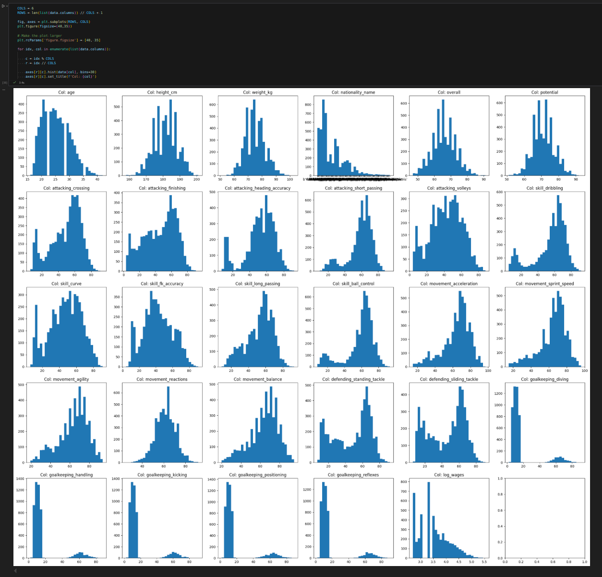

## Part A: Data Preprocessing (Notes)

Histogram of data:

Generally, the data seems ok. One observation is that goalkeeping statistics are spread across two peaks, with either very low scores or relatively high ones.

All skill values seem to be on a `[0, 100]` scale. The ones that have custom scale are those that depict personal characteristics (age, weight, nationality, salary).

Most data is numeric. One column `nationality_name` is textual and must be preprocessed to be used. For this, it seems that the sklearn functionality linked in the assignment can be used (https://scikit-learn.org/stable/modules/preprocessing.html#encoding-categorical-features).

Example in `categorical_preprocess.ipynb`